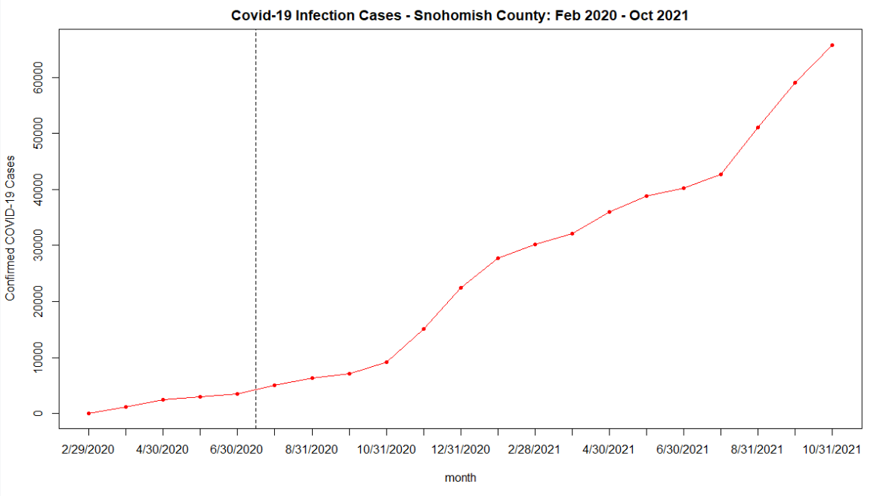
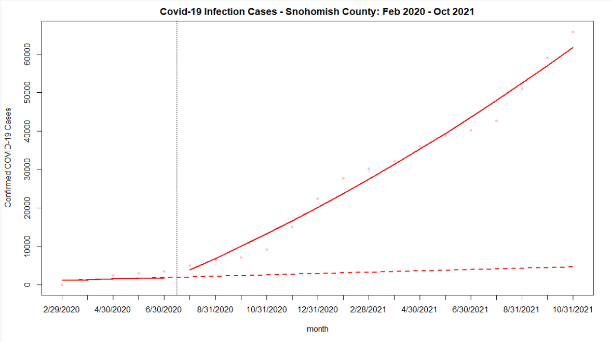
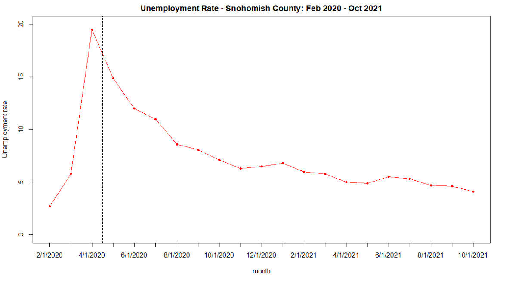
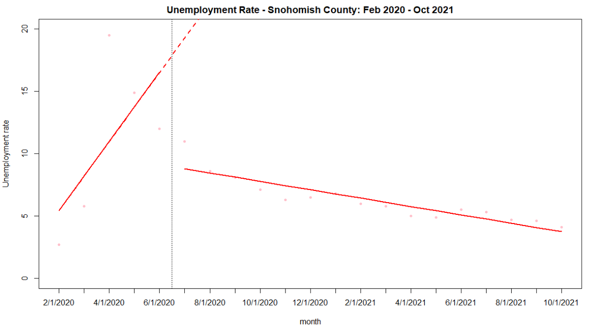

# Human Centered Data Science - Project Part 1 - Common Analysis

## About the Project
The Snohomish County of Washington State implemented masking policies during the outbreak of the Covid pandemic. The aim was to reduce the progression of confirmed COVID-19 cases within the County. My objective was to evaluate the impact that the masking policy had on the progression of the COVID-19 virus and the effect that this policy had on unemployment rate.

This project was part of Human Centered Data Science at the University
of Washington - Seattle for Autumn 2022. This repository contains all the details to reproduce this analysis independently on any machine without the use of any specific software package.

## Data Source
The data acquisition was done acquired from the three different data sources. The details for the data source is present below:

1. [John Hopkins University COVID-19 data](https://www.kaggle.com/datasets/antgoldbloom/covid19-data-from-john-hopkins-university)
2. [masking mandates by county](https://data.cdc.gov/Policy-Surveillance/U-S-State-and-Territorial-Public-Mask-Mandates-Fro/62d6-pm5i)
3. [mask compliance survey](https://github.com/nytimes/covid-19-data/tree/master/mask-use)
4. [Unemployment Rate in Snohomish County, WA](https://fred.stlouisfed.org/series/WASNOH0URN)


## Directory Structure
The directory structure for the repository has been shown below in the form of a tree.

```

.
├── data
│   ├── snohomish_monthly_infections.csv
│   ├── unemployment_rate.csv
│   └── raw
│       ├── mask_policy_snohomish.csv
│       ├── mask_use_snohomish.csv
│       └── snohomish_daily_infections.csv
├── plots
│   ├── covid_19_cases_by_month_final_plot.png
│   ├── covid_19_cases_initial_plot.png
│   ├── umployment_rate_initial_plot.png    
│   └── unemployment_rate_final_plot.png
│ 
├── src
│   └── data_512_final_project.Rmd
│ 
├── docs
│   └── project_code.pdf
│   └── Project_Report.pdf
│ 
├── README.md
└── LICENSE


```

## Data Description
The data description for the csv files is shown below:
1. # John Hopkins University COVID-19 data - snohomish_daily_infections (raw)

| Column                    | Description                                                                        |
| ------------------------- | -----------------------------------------------------------------------------------|
| `date`           | date of infection                                                       |
| `infections`                  | number of infections                                                     |


2. # masking mandates by county - mask_policy_snohomish.csv (raw)

| Column                    | Description                                                                        |
| ------------------------- | -----------------------------------------------------------------------------------|
| `date`                         | date of the year                                               |
| `Face_Masks_Required_in_Public`| indicates if mask is required in public or not                                           |


3.  # mask compliance survey - mask_use_snohomish.csv

| Column                    | Description                                                                        |
| ------------------------- | -----------------------------------------------------------------------------------|
| `COUNTYFP`                | FYP code of the country                                                 |
| `NEVER`                  | Percentage of population in territory who NEVER wear the mask                                 |
| `RARELY`                 | Percentage of population in territory who RARELY wear the mask                       |
| `SOMETIMES`               | Percentage of population in territory who SOMETIMES wear the mask  |
| `FREQUENTLY`              | Percentage of population in territory who FREQUENTLY wear the mask  |
| `ALWAYS`                  | Percentage of population in territory who ALWAYS wear the mask  |


4.  # Unemployment Rate in Snohomish County, WA

| Column                    | Description                                                                        |
| ------------------------- | -----------------------------------------------------------------------------------|
| `month`                | period within the year                                                |
| `rate`                  | Unemployment rate                                 |
| `time`                 | Represents time since start of the study period                      |
| `level`               | Indicates whether the time t is before (0) or after (1) the implementation of the intervention|
| `trend`              | represents time elapsed since intervention implementation, taking a value of 0 prior to the intervention  |


5.  # Snohomish County Monthly Infections
| Column                    | Description                                                                        |
| ------------------------- | -----------------------------------------------------------------------------------|
| `month`                | period within the year                                                |
| `infections`                  | Monthly infections                                 |
| `time`                 | Represents time since start of the study period                      |
| `level`               | Indicates whether the time t is before (0) or after (1) the implementation of the intervention|
| `trend`              | represents time elapsed since intervention implementation, taking a value of 0 prior to the intervention  |


## Visualization










## License

This code is available under the [MIT License](LICENSE)

Wikimedia [Terms of Use](https://foundation.wikimedia.org/wiki/Terms_of_Use/en)
